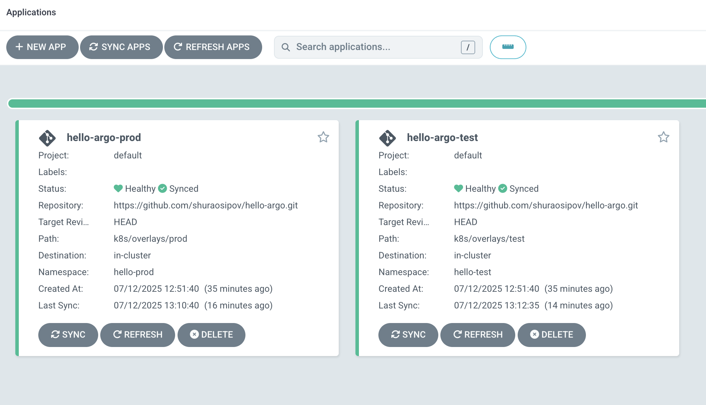

# 🚀 Hello ArgoCD: GitOps Deployment on Local Kubernetes

This project demonstrates how to build a simple Python web app, containerize it, push the Docker image to a registry, and deploy it on a local Kubernetes cluster using **Argo CD** and **GitOps** principles.

---

## 📆 Stack

* Python 3
* Docker + Docker Hub
* Kubernetes (via Docker Desktop on macOS)
* Argo CD
* Git (GitHub, GitLab, etc.)

---

## 🛠️ Prerequisites

Ensure the following are installed:

* [Docker Desktop for Mac](https://www.docker.com/products/docker-desktop/)

  * Enable Kubernetes in Docker Desktop → Settings → Kubernetes

* [kubectl](https://kubernetes.io/docs/tasks/tools/install-kubectl/)

  ```bash
  brew install kubectl
  ```

* [Argo CD CLI](https://argo-cd.readthedocs.io/en/stable/cli_installation/)

  ```bash
  brew install argocd
  ```

* [Git](https://git-scm.com/)

---

## 🧱 Step 1: Create and Test the Hello World App

### 1. Create project folder

```bash
mkdir hello-argo && cd hello-argo
```

### 2. Create `app.py`

```python
# app.py
from http.server import HTTPServer, BaseHTTPRequestHandler

class Handler(BaseHTTPRequestHandler):
    def do_GET(self):
        self.send_response(200)
        self.send_header("Content-Type", "text/plain")
        self.end_headers()
        self.wfile.write(b"Hello from ArgoCD!")

server = HTTPServer(('0.0.0.0', 8080), Handler)
print("Listening on 8080")
server.serve_forever()
```

### 3. Create `Dockerfile`

```Dockerfile
# Dockerfile
FROM python:3.11-slim
WORKDIR /app
COPY app.py .
CMD ["python", "app.py"]
```

### 4. Build and test locally

```bash
docker build -t hello-argo:local .
docker run -p 8080:8080 hello-argo:local
```

Visit [http://localhost:8080](http://localhost:8080) — you should see:

```
Hello from ArgoCD!
```

---

## 🚢 Step 2: Push Docker Image to Docker Hub

### 1. Login to Docker Hub

```bash
docker login
```

### 2. Tag your image

```bash
docker tag hello-argo:local yourusername/hello-argo:latest
```

### 3. Push the image

```bash
docker push yourusername/hello-argo:latest
```

---

## 📁 Step 3: Prepare Kubernetes Manifests

This project uses **Kustomize overlays** to manage multiple environments (`test`, `prod`) while reusing a shared `base`.

### Folder Structure

```
k8s/
├── base/
│   ├── deployment.yaml
│   ├── service.yaml
│   └── kustomization.yaml
└── overlays/
    ├── test/
    │   ├── kustomization.yaml
    │   ├── image-tag.yaml
    │   └── replica-count.yaml
    └── prod/
        ├── kustomization.yaml
        ├── image-tag.yaml
        └── replica-count.yaml
```

### `k8s/base/deployment.yaml`

```yaml
apiVersion: apps/v1
kind: Deployment
metadata:
  name: hello-argo
spec:
  replicas: 2
  selector:
    matchLabels:
      app: hello-argo
  template:
    metadata:
      labels:
        app: hello-argo
    spec:
      containers:
        - name: hello-argo
          image: yourusername/hello-argo:latest
          ports:
            - containerPort: 8080
```

### `k8s/base/service.yaml`

```yaml
apiVersion: v1
kind: Service
metadata:
  name: hello-argo
spec:
  selector:
    app: hello-argo
  ports:
    - protocol: TCP
      port: 80
      targetPort: 8080
  type: NodePort
```

### `k8s/base/kustomization.yaml`

```yaml
resources:
  - deployment.yaml
  - service.yaml
```

### Example `k8s/overlays/test/kustomization.yaml`

```yaml
resources:
  - ../../base
patchesStrategicMerge:
  - image-tag.yaml
  - replica-count.yaml
```

**`image-tag.yaml` (test):**

```yaml
apiVersion: apps/v1
kind: Deployment
metadata:
  name: hello-argo
spec:
  template:
    spec:
      containers:
        - name: hello-argo
          image: yourusername/hello-argo:test
```

**`replica-count.yaml` (test):**

```yaml
apiVersion: apps/v1
kind: Deployment
metadata:
  name: hello-argo
spec:
  replicas: 1
```

### `prod` overlay is similar but uses different image/tag or replica count:

```yaml
image: yourusername/hello-argo:latest
replicas: 3
```

---

## 📂 Step 4: Initialize and Push Git Repository

```bash
git init
git add .
git commit -m "Initial commit with app, Dockerfile, and Kubernetes manifests"
git remote add origin https://github.com/YOUR_USERNAME/hello-argo.git
git push -u origin main
```

---

## 🚀 Step 5: Install Argo CD on Local Kubernetes

### 1. Apply Argo CD installation manifest

```bash
kubectl create namespace argocd
kubectl apply -n argocd -f https://raw.githubusercontent.com/argoproj/argo-cd/stable/manifests/install.yaml
```

### 2. Port-forward Argo CD UI

```bash
kubectl port-forward svc/argocd-server -n argocd 8080:443
```

Access [https://localhost:8080](https://localhost:8080)

### 3. Get the initial admin password

```bash
kubectl get secret argocd-initial-admin-secret -n argocd \
  -o jsonpath="{.data.password}" | base64 -d
```

Login via Argo CD CLI:

```bash
argocd login localhost:8080
argocd account update-password
```

---

## 📱 Step 6: Deploy App with Argo CD

### 1. Apply the ApplicationSet

If you're using the included `argocd-apps/applicationset.yaml`, run:

```bash
kubectl apply -f argocd-apps/applicationset.yaml -n argocd
```

This will automatically create two Argo CD Applications:

* `hello-argo-test` → uses `k8s/overlays/test`
* `hello-argo-prod` → uses `k8s/overlays/prod`

### 2. Sync the apps

```bash
argocd app sync hello-argo-test
argocd app sync hello-argo-prod
```

### 3. Check the app status

```bash
argocd app get hello-argo-test
argocd app get hello-argo-prod
```


---

## ✅ Access the App

```bash
kubectl get svc -n hello-test
kubectl get svc -n hello-prod
```

Then port-forward to access them locally:

```bash
kubectl port-forward svc/hello-argo -n hello-test 8081:80
kubectl port-forward svc/hello-argo -n hello-prod 8082:80
```

Visit:

* [http://localhost:8081](http://localhost:8081) → Test
* [http://localhost:8082](http://localhost:8082) → Prod

---

## 🔄 Optional: Enable Auto-Sync

```bash
argocd app set hello-argo-test --sync-policy automated
argocd app set hello-argo-prod --sync-policy automated
```

---

## 📘️ References

* [Argo CD Docs](https://argo-cd.readthedocs.io/)
* [Kubernetes Docs](https://kubernetes.io/docs/)
* [Docker Docs](https://docs.docker.com/)